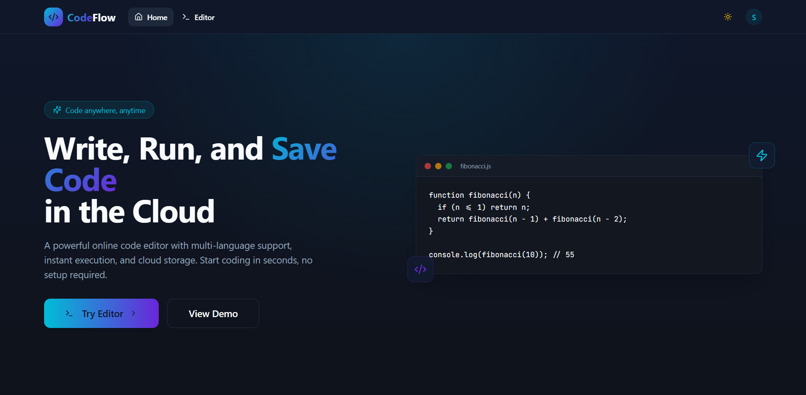
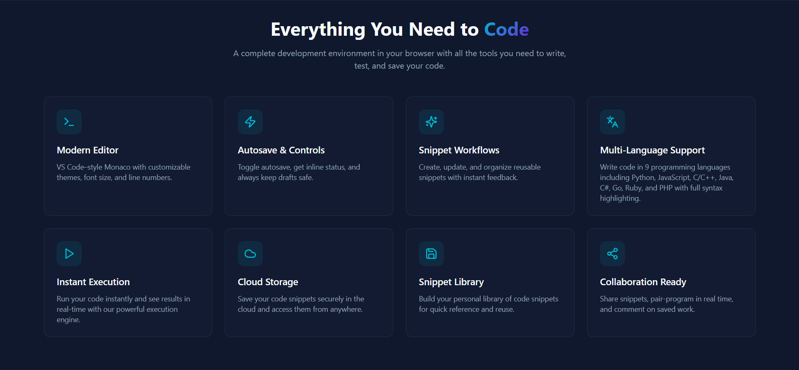
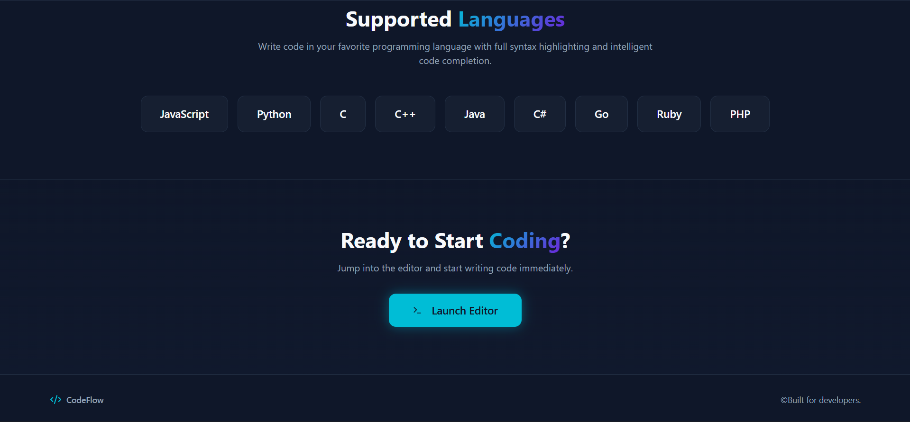
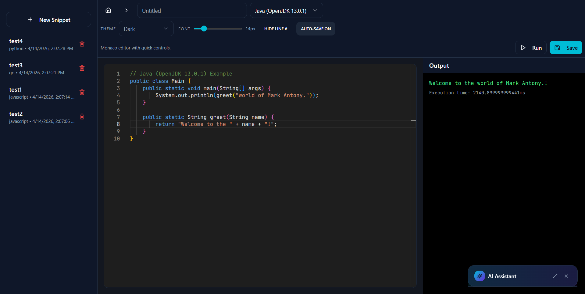

# 🚀 CodeFlow

## 💡 Why CodeFlow?

CodeFlow was built to provide a fast, cloud-based coding environment with AI assistance, eliminating the need for local setup and enabling developers to code anywhere.


# 📸 Preview

### 🏠 Landing Page


### ⚙️ Features Section


### 🌐 Supported Languages


### 💻 Code Editor


## ✨ Features

### 🎯 Core Features
- **AI-Powered Coding Assistant**: Get real-time code suggestions and completions
- **Monaco Editor**: The same editor that powers VS Code
- **Real-time Execution**: Run code directly in browser using Judge0 API
- **Theme Support**: Light and dark themes with system preference detection

### 💾 Snippet Management
- **Save & Organize**: Save and manage your code snippets
- **Folder Organization**: Create nested folder structures for better organization
- **Duplicate Handling**: Automatically appends timestamps to duplicate snippet names
- **User-Specific Storage**: Each user's snippets are private and secure
- **Delete Protection**: Confirmation dialog before deleting snippets with ownership verification

### 🎨 Editor Features
- **Monaco Editor**: Full-featured code editor with IntelliSense
- **Syntax Highlighting**: Beautiful syntax highlighting for multiple languages
- **Theme Options**: Light and dark themes with system preference detection
- **Line Numbers**: Toggle line numbers on/off

### 🔐 Authentication
- **Firebase Authentication**: Secure user authentication with enhanced error handling
- **Email/Password**: Traditional email and password authentication
- **Google Sign-in**: One-click Google authentication
- **Email Verification**: Verify email addresses for added security
- **Password Reset**: Easy password recovery flow
- **User-Friendly Errors**: Clear error messages for common auth issues

### ⚡ Performance
- **Optimized Build**: Built with Vite for fast development and production builds
- **Efficient State Management**: React Context for global state
- **Global CDN**: Deployed on Vercel for lightning-fast load times worldwide

## 🛠️ Tech Stack

### Frontend
- **React 18** - Modern UI library
- **TypeScript** - Type-safe development
- **Vite 5.4.10** - Lightning-fast build tool
- **React Router** - Client-side routing
- **TailwindCSS** - Utility-first CSS framework

### UI Components
- **shadcn/ui** - Accessible components built on Radix UI
- **Monaco Editor** - Professional code editor
- **Lucide React** - Beautiful icon library

### Backend & API
- **Firebase Authentication** - User authentication service
- **Vercel Functions** - Serverless API endpoints
- **Google Generative AI** - AI coding assistant backend

### Code Execution
- **Judge0 API** - Reliable code execution service
  - Supports 15+ programming languages
  - Asynchronous execution with polling
  - No whitelist restrictions

### AI Integration
- **Google Generative AI** - Powers AI coding assistant
- **React Query** - Data fetching and caching

## 📦 Installation

### Prerequisites
- **Node.js** (v18 or higher)
- **npm** or **yarn** or **bun**
- **Git**
- **Firebase Account** (for authentication)
- **Google AI API Key** (for AI features)
- **Vercel Account** (for deployment)

### Setup Instructions

1. **Clone the Repository**
   ```bash
   git clone https://github.com/SharveshC/CodeFlow.git
   cd CodeFlow
   ```

2. **Install Dependencies**
   ```bash
   npm install
   # or
   yarn install
   # or
   bun install
   ```

3. **Set up Firebase Authentication**
   - Create a new Firebase project at [Firebase Console](https://console.firebase.google.com/)
   - Enable Authentication (Email/Password and Google)
   - Get your Firebase configuration object

4. **Configure Environment Variables**
   Create a `.env` file in root directory:
   ```env
   # Firebase Configuration
   VITE_FIREBASE_API_KEY=your-api-key
   VITE_FIREBASE_AUTH_DOMAIN=your-project.firebaseapp.com
   VITE_FIREBASE_PROJECT_ID=your-project-id
   VITE_FIREBASE_STORAGE_BUCKET=your-project.appspot.com
   VITE_FIREBASE_MESSAGING_SENDER_ID=your-sender-id
   VITE_FIREBASE_APP_ID=your-app-id
   VITE_FIREBASE_MEASUREMENT_ID=your-measurement-id
   
   # Deployment Configuration
   VITE_DEPLOYMENT_PLATFORM=vercel
   VITE_AI_ENDPOINT=/api/ai-chat
   ```

5. **Get Google AI API Key**
   - Go to [Google AI Studio](https://makersuite.google.com/app/apikey)
   - Create a new API key
   - **Important**: Add this key only in Vercel environment variables

6. **Run Development Server**
   ```bash
   npm run dev
   ```
   
   The app will be available at `http://localhost:8080`

7. **Deploy to Vercel**
   - Push your code to GitHub
   - Go to [Vercel](https://vercel.com) and import your repository
   - Add environment variables in Vercel dashboard:
     - All Firebase variables from step 4
     - `GOOGLE_AI_API_KEY=your-actual-google-ai-key`
   - Deploy!

8. **Configure Firebase Domains**
   - In Firebase Console → Authentication → Settings
   - Add your Vercel domain to authorized domains

## 🎮 Usage

### Getting Started

1. **Sign Up / Login**
   - Navigate to landing page
   - Click "Get Started" or "Login"
   - Sign in with Google or create an account with email/password
   - Enhanced error messages guide you through any issues

2. **Write Code**
   - Select a programming language from dropdown (15+ languages supported)
   - Write or paste your code in Monaco editor
   - Use toolbar to customize theme, font size, and line numbers

3. **Run Code**
   - Click "Run" button or press `F5` or `Ctrl+Enter`
   - View output in console panel
   - See execution time for performance monitoring
   - Code execution powered by Judge0 API

4. **Save Snippets**
   - Enter a title for your snippet
   - Optionally select a folder or create a new one
   - Click "Save" or press `Ctrl+S`
   - Duplicate names automatically get timestamp appended
   - Auto-save will save changes automatically after 2 seconds of inactivity

5. **Manage Snippets**
   - View all your snippets in left sidebar
   - Navigate through folder structure
   - Use search bar to find specific snippets
   - Filter by programming language
   - Click on a snippet to load it
   - Hover over a snippet and click trash icon to delete (with confirmation)

### Keyboard Shortcuts

- `Ctrl+S` / `Cmd+S` - Save current snippet
- `F5` - Run code

## 📁 Project Structure

```
CodeFlow/
├── public/                  # Static assets
├── src/
│   ├── components/         # React components
│   │   ├── ui/            # shadcn/ui components
│   │   ├── EditorComponent.tsx
│   │   └── SnippetList.tsx
│   ├── contexts/          # React contexts
│   │   └── AuthContext.tsx
│   ├── hooks/             # Custom React hooks
│   │   ├── useAutoSave.ts
│   │   └── useKeyboardShortcuts.ts
│   ├── integrations/      # Third-party integrations
│   │   └── firebase/
│   │       ├── client.ts
│   │       └── config.ts
│   ├── lib/               # Utility functions
│   │   ├── firebase.ts    # Firebase configuration
│   │   ├── snippets.ts    # Snippet CRUD operations
│   │   ├── security.ts    # Security utilities
│   │   └── utils.ts       # General utilities
│   ├── pages/             # Page components
│   │   ├── Editor.tsx     # Main editor page
│   │   ├── Landing.tsx    # Landing page
│   │   ├── Login.tsx      # Login page
│   │   ├── Signup.tsx     # Signup page
│   │   └── VerifyEmail.tsx
│   ├── App.tsx            # Main app component
│   ├── main.tsx           # Entry point
│   └── index.css          # Global styles
├── api/                  # Vercel serverless functions
│   └── ai-chat.js        # AI chat API endpoint
├── .env                   # Environment variables (not in repo)
├── .env.example           # Environment variables template
├── package.json           # Dependencies
├── vercel.json           # Vercel configuration
├── vite.config.ts         # Vite configuration
└── tailwind.config.ts     # Tailwind CSS configuration
```

## 🔥 Firebase Setup

### Authentication Setup

1. Go to **Firebase Console** → **Authentication**
2. Enable **Email/Password** sign-in method
3. Enable **Google** sign-in method
4. Add your Vercel domain to authorized domains

### Environment Variables

Add these Firebase variables to your Vercel environment:
```
VITE_FIREBASE_API_KEY=your-api-key
VITE_FIREBASE_AUTH_DOMAIN=your-project.firebaseapp.com
VITE_FIREBASE_PROJECT_ID=your-project-id
VITE_FIREBASE_STORAGE_BUCKET=your-project.appspot.com
VITE_FIREBASE_MESSAGING_SENDER_ID=your-sender-id
VITE_FIREBASE_APP_ID=your-app-id
VITE_FIREBASE_MEASUREMENT_ID=your-measurement-id
```

### Supported Languages
- JavaScript (Node.js 18.15.0)
- Python (3.10.0)
- Java (15.0.2)
- C (10.2.0)
- C++ (10.2.0)
- C# (6.12.0)
- Go (1.16.0)
- Rust (1.56.0)
- PHP (8.0.0)


## 📝 License

This project is licensed under the MIT License - see the [LICENSE](LICENSE) file for details.

## 👥 Contributors

- **Sharvesh C**  
  GitHub: [@SharveshC](https://github.com/SharveshC)

- **Likhith**  
  GitHub: [@likhith1253](https://github.com/likhith1253)


